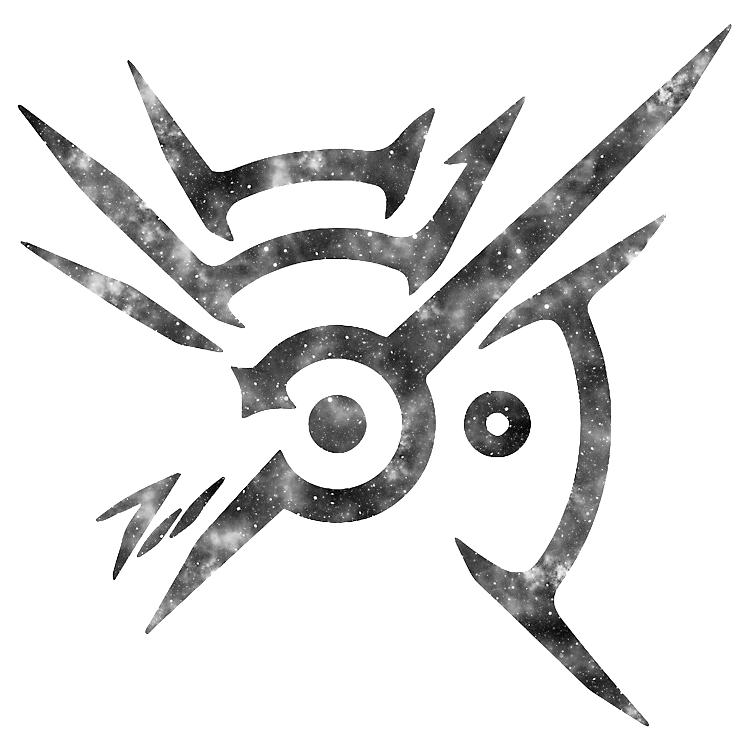

# 
<b>HAND WIGI</b>

A hand recognition&amp;interaction app based on mediapipe and OpenCV.

## Get started

  Release提供的完整包含有运行库，点击目录下HAND WIGI.exe即可启动。
  
  启动前务必确保文件夹路径不含有中文，不然可能无法访问到mediapipe的路径。
  
  尽量保证手掌平面与相机取相平面平行，环境光适宜，识别效果最佳。尤其是在鼠标控制功能下需要较高的识别精度来获得较好的效果。
  
## Manual

1. 手势识别
- 以常见的向量方法为基础
- 通过手指关节点构建向量，设定角度阈值，以向量夹角大小与阈值判断手指是否弯曲，通过各个手指的弯曲状况判定手势。
- 增设了对于Thumb Up/Down的区别判断，判断拇指尖相对掌心位置即可。
- 增设了对于OK手势的辅助判断，因为OK手势食指和拇指尚未达到弯曲阈值，降低阈值又会引起其他手势识别不准确，所以单独做判断。
2. 手势控制
- 基于pyautogui实现鼠标控制
- 结合模型预测的指尖关键点离摄像机距离和食指与手指距离比例得出统一的捏合阈值。
- 可以实现单击、双击、按住拖动以及右键（保持手不动捏住3秒左右，期间掌心位置偏移不能大于1像素）
- 握拳时暂停鼠标控制，可以实现相当于鼠标挪到鼠标垫边界后拿起鼠标放到合适位置的操作。
3. PPT翻页助手
- 用pyautogui实现键盘pageup和pagedown信号的发出
- 握拳上下移动表示翻页，操作逻辑等同于抓取上下拉动。
- 握拳识别结合了多种方法：向量方法的0识别（很不稳定）、设计的拇指关节点的靠近距离+手部凸包占最小覆盖圆比例+拇指到凸包最短距离

## License

 MIT License
